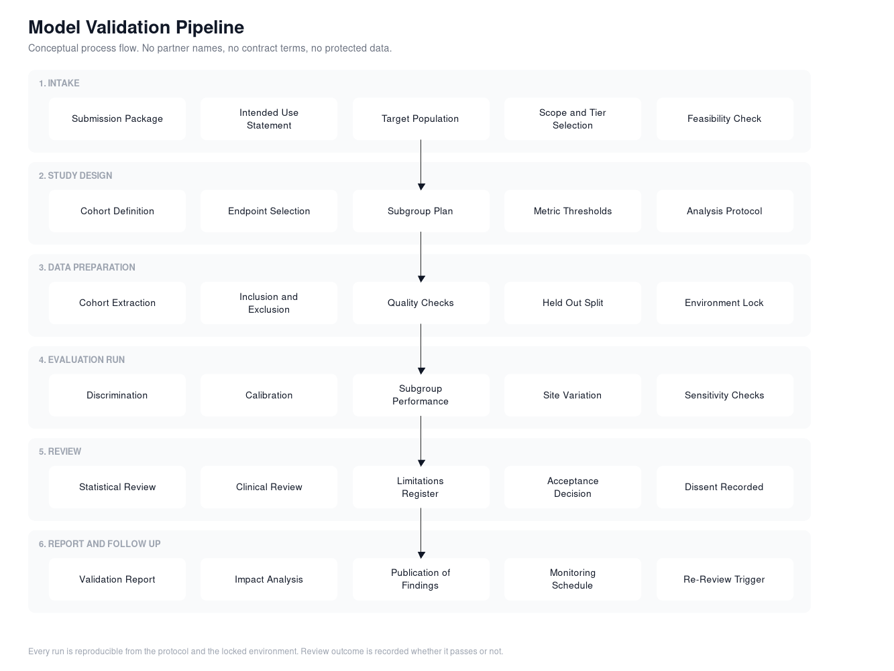

# Independent AI Validation Lab: Product and Architecture Work

Product strategy, discovery, and system design for an independent lab that evaluates clinical AI models before hospitals deploy them, with a cardiovascular focus.

Public references for the program this work supports:
- [AHA AI Assessment Lab](https://www.heart.org/en/professional/quality-improvement/aha-ai-assessment-lab)
- [Fierce Healthcare coverage of the HLTH 2025 announcement](https://www.fiercehealthcare.com/ai-and-machine-learning/hlth25-aha-unveils-ai-assessment-lab-validate-models-heart-health)

I led product and architecture work for this. The repository holds the problem framing, the product structure, the operating model, the reference diagrams, and a runnable evaluation scaffold. It contains no internal documents, no partner or donor names, no pricing, no contract terms, and no patient data. Everything here is either public or written at a level of generality that gives away nothing.

## The problem

A hospital that wants to buy a clinical AI tool has almost no way to check whether it works for their patients.

The vendor supplies a paper and a performance curve from a population that may look nothing like the one walking through the door. Large academic centers can run their own check because they have data scientists and evaluation infrastructure. Small, rural, and mid-size hospitals cannot. Those are the same places where cardiovascular outcomes are already worst, so the gap compounds.

Four specific failures:

1. **No independent read.** Evaluation is done by the party selling the tool. Buyers have no neutral comparison.
2. **No capacity on the buyer side.** Most hospitals have no way to test a model against their own population before signing.
3. **Population mismatch is invisible.** Overall accuracy hides the subgroups where a model quietly fails.
4. **Nothing after go-live.** Performance decays and almost nobody is watching.

The buyers want proof. The developers want a credible third party to give it to them. Neither side wants to build the evaluation apparatus. That gap is the product.

## What the lab does

Four connected offerings under one program.

| Offering | What it produces | Who buys it |
| --- | --- | --- |
| **Validation** | Performance and calibration results against a defined population, with subgroup breakdowns | Model developers, health systems |
| **Impact analysis** | Clinical and operational effect estimates for a specific deployment setting | Health systems |
| **Monitoring** | Scheduled re-checks for drift, calibration decay, and new subgroup gaps | Both, as a subscription |
| **Evidence packaging** | Validation output assembled for regulatory and payer conversations | Model developers |

Validation is the anchor. The other three only exist because the first one produces reusable evidence.

## Documents

| File | Contents |
| --- | --- |
| [docs/discovery.md](docs/discovery.md) | How the problem was framed, what the market said, why this organization can run it |
| [docs/product-architecture.md](docs/product-architecture.md) | The four offerings, tiers, inputs, outputs, and what is deliberately out of scope |
| [docs/operating-model.md](docs/operating-model.md) | Governance, review structure, the per-model process, and decision rights |
| [docs/data-architecture.md](docs/data-architecture.md) | Data access patterns, evaluation stack, reproducibility requirements |
| [docs/roadmap.md](docs/roadmap.md) | Phasing, entry and exit criteria per phase, and what could sink it |
| [docs/validation-protocol-template.md](docs/validation-protocol-template.md) | Fill in the blank protocol used before any evaluation runs |

## Diagrams

The validation process, intake through follow up:



The data and evaluation architecture underneath it:


Sources are in `docs/`. Both diagrams have `.svg` versions, and `docs/validation-pipeline.mmd` is Mermaid source that Lucidchart imports directly and GitHub renders in the browser.

## Code

`poc/` holds a working evaluation scaffold that runs on synthetic data. It is a template for how a study is specified, run, and reported, not a production system.

```
python poc/run_validation.py --config poc/config/example_study.yaml
```

That writes a validation report and a results file to `poc/output/`. See [poc/README.md](poc/README.md) for what each module covers.

## What I brought to this work

- Framed the problem around the buyer who cannot self-evaluate, which is what made the program fundable and mission-aligned rather than a generic testing service.
- Designed the product structure so one evaluation run feeds four offerings instead of four separate builds.
- Designed the data architecture around access patterns rather than data movement, since the governance constraint, not the compute, is what decides whether a study can run.
- Set the reproducibility requirement: locked protocol, locked environment, archived results, re-runnable on demand. A validation body that cannot reproduce its own results has no standing.
- Wrote the evaluation scaffold that turned the concept into something an engineer could pick up and extend.

## Contact

GitHub: [ali8gates](https://github.com/ali8gates)
