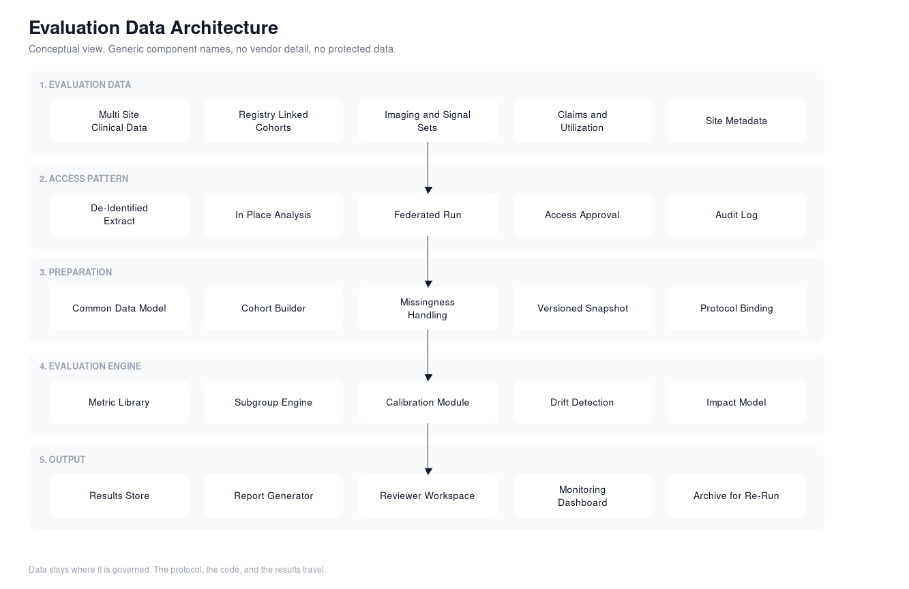

# Data and Evaluation Architecture

The hard part of this program is not the statistics. It is getting a defensible cohort in front of the model without moving data that should not move.

## Access patterns, in order of preference

The architecture is organized around how data can be reached, because that constraint decides what studies are possible.

**De-identified extract.** A prepared multi-site dataset the lab can analyze under an access agreement. Fastest path, best for early studies, weakest for site specific questions.

**Analysis in place.** The lab brings the protocol and the code into an environment the data holder controls. Nothing leaves except results. Slower to set up, and the right default at scale.

**Federated run.** For sites that will not export anything. The model and the evaluation code travel to each site, results come back, and the analysis combines them. Highest coordination cost, and the only way to include a large part of the market.

The engine is identical across all three. Only the placement changes. That is deliberate, and it is what stops the program from being rebuilt every time a new data partner joins.

## Data phasing

**Phase one.** Multi-site de-identified data with breadth across geography and hospital type. Enough sites to say something about variation, not just average performance.

**Phase two.** Registry linked cohorts, which add clinical depth, validated outcome definitions, and guideline aligned endpoints. This is the differentiator. Anyone can buy a claims extract. Almost nobody has curated cardiovascular cohorts with clinical adjudication behind them.

**Phase three.** In place and federated evaluation with individual health systems, including the small and rural sites the program exists to serve. Also the only way to answer whether a model works at a specific hospital rather than on average.

## Preparation layer

- A common data model, so a cohort definition means the same thing across sources.
- A cohort builder driven by the written protocol rather than ad hoc query.
- Explicit missingness handling, declared in the protocol, not decided during analysis.
- Versioned snapshots. A study points at a snapshot id, never at a live table.
- Protocol binding, so the code that runs is tied to the approved analysis plan.

## Evaluation engine

- Metric library: discrimination, calibration, operating point behavior, uncertainty intervals.
- Subgroup engine: consistent group definitions, minimum cell sizes, gap calculation against overall.
- Calibration module, reported in the deployment range rather than as one global number.
- Drift detection: covariate shift, score distribution shift, calibration decay against baseline.
- Impact model: alert burden, detection yield, and cost effects driven by declared inputs.

## Output layer

- Results store with the full numeric output, not just what made the report.
- Template driven report generation so two studies are comparable on sight.
- A reviewer workspace where the panel sees the analysis, not a summary of it.
- Monitoring views for models under active surveillance.
- An archive holding protocol, snapshot reference, code version, and environment for every completed study.

## Reproducibility requirements

These are non-negotiable for a body whose only asset is credibility.

1. Any completed study can be re-run and produce the same numbers.
2. The protocol is written and approved before data access, and amendments are timestamped.
3. Code and environment are versioned with the result.
4. The cohort is a fixed snapshot, addressable by id.
5. Every published number traces back to a specific run.

If a result cannot be reproduced, it cannot be defended, and a validation body that cannot defend its results is worth nothing.

## Compute

A lakehouse style environment handles the mixed workload: structured records, time series signals, and imaging, with versioned tables and reproducible pipelines. The specific platform matters much less than three properties: table versioning, reproducible job execution, and the ability to run the same pipeline inside someone else's environment.
